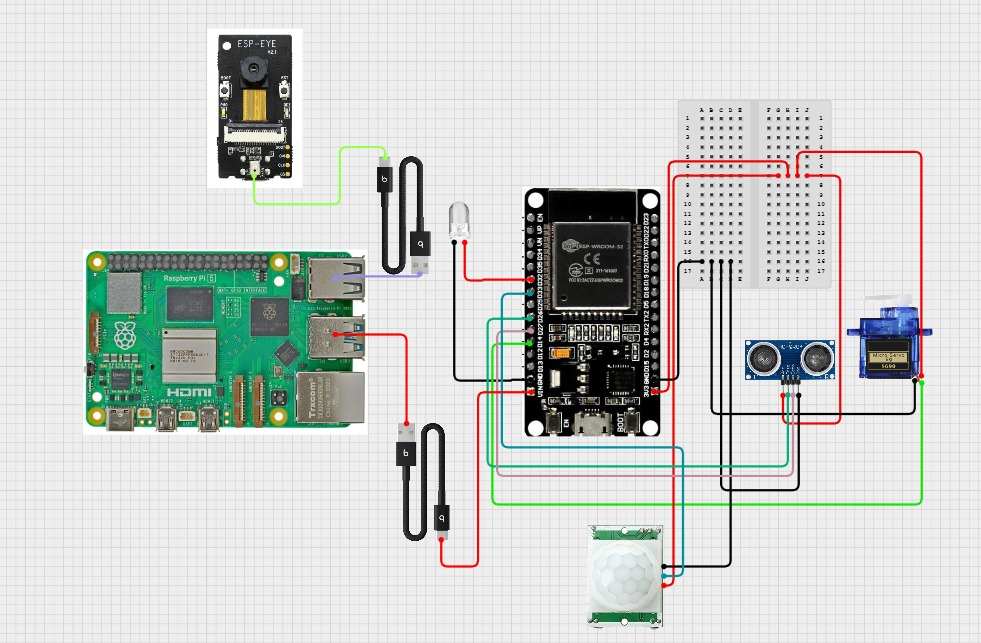

# Smart Bird Feeder With Species Recognition

This project was developed during the IoT Architecture lab course by:

**Adam Ridene** & **Rayen Landolsi**
Undergraduate students — Embedded Systems and IoT Bachelor's Program

Under the supervision of **Hanen KARAMTI**, Computer Science Assistant Professor,
Higher Institute of Multimedia Arts of Manouba (ISAMM), University of Manouba, Tunisia.

---

## Description

The Smart Bird Feeder is an intelligent, IoT-based environmental monitoring system designed for **Smart Agriculture**. It combines a connected bird feeder with embedded artificial intelligence to detect, identify, and collect data on local bird populations.

The system captures images upon detecting motion, uses computer vision to identify the bird species, and uploads the sighting to a cloud backend accessible via a mobile application. All observations are logged into a personal digital **ornithological book** for the user to consult.

---

## Problem Statement

Designing an intelligent, autonomous system capable of identifying bird species at a feeder while:
- Collecting reliable, connected data.
- Minimizing overall hardware and operational costs.
- Operating independently in an outdoor environment.

---

## Objectives

### 1. Automated Monitoring
Design an IoT system that monitors a feeder and identifies bird species via computer vision.

### 2. Presence Detection
Use a PIR (HC-SR501) motion sensor connected to an ESP32 to detect feeder visitors and trigger the camera pipeline only when needed, conserving power.

### 3. Cloud Integration
Use cloud technologies for remote data storage, real-time visualization, and mobile synchronization.

---

## System Architecture

The system is built around three physical nodes that communicate together:

```
[HC-SR501 PIR Sensor]
        |
   [ESP32 (PIR)]  --USB Serial--> [Raspberry Pi]  --USB Serial--> [ESP-EYE (Camera)]
                                        |
                              [YOLO NCNN Inference]
                                        |
                              [Supabase Cloud Storage]
                                        |
                                 [Flutter Mobile App]
```

### Data Flow

1. The **PIR ESP32** continuously monitors for motion and sends a `"Motion detected"` message over USB serial when triggered.
2. The **Raspberry Pi** runs `usb_reader.py`, which listens for this signal. Upon detection, it sends a `START` command over a second USB serial port to the **ESP-EYE**.
3. The **ESP-EYE** initializes its camera, connects to Wi-Fi, and starts serving an MJPEG stream at `http://espeye.local:81/stream`.
4. The Raspberry Pi then runs `inference_after_getting_video_stream.py`, which:
   - Opens the MJPEG stream via OpenCV.
   - Runs the YOLO NCNN model frame-by-frame to detect and classify birds.
   - Crops the detected bird from the frame and uploads it to **Supabase** cloud storage.
5. After **30 seconds of inactivity** (no detections), the inference script exits and the system returns to the listening state — saving power.
6. The whole cycle is managed by `manager.sh`, which is registered as a **systemd service** (`birdfeeder.service`) so it starts automatically on boot.

---

## Requirements

### Hardware

| Component | Role |
|---|---|
| Raspberry Pi | Edge computing — runs AI inference and orchestration |
| ESP-EYE | Video streaming via Wi-Fi MJPEG |
| ESP32 | Reads the PIR sensor and signals the Raspberry Pi |
| HC-SR501 PIR Sensor | Motion detection |
| Ultrasonic Sensor | Proximity sensing (optional) |
| Micro SD Card | Local backup |

### Software & Platforms

| Tool / Platform | Purpose |
|---|---|
| Arduino IDE | Firmware for ESP32 and ESP-EYE |
| Python 3 + OpenCV | Video capture and inference pipeline |
| Ultralytics YOLOv8 | Model training (Google Colab) |
| NCNN | Optimized on-device inference on Raspberry Pi |
| Optuna | Hyperparameter tuning during training |
| Supabase | Cloud authentication and image storage |
| Flutter (Dart) | Mobile application |
| systemd | Service management on Raspberry Pi |
| Shell (Bash) | Orchestration script (`manager.sh`) |

### Dataset

Bird species dataset sourced from **Roboflow** (Workspace: `adam-ridene-try`, Project: `bird-feeder-bird-classification-vhngb`). The dataset covers 7 species: Blackbird, Blue Tit, Goldfinch, Great Tit, Greenfinch, Robin, and Sparrow.

---

## Installation & Setup

### 1. ESP-EYE Firmware

Open `ESP_EYE_connection_enhanced.ino` in the Arduino IDE and fill in your Wi-Fi credentials:

```cpp
const char *ssid = "YOUR_WIFI_SSID";
const char *password = "YOUR_WIFI_PASSWORD";
```

Flash to the ESP-EYE. The device boots in **slave mode** — it does nothing until it receives a `START` command over serial (115200 baud). It also accepts a `STOP` command to shut down Wi-Fi and the camera to save power.

The stream is served at: `http://espeye.local:81/stream`

### 2. PIR ESP32 Firmware

Flash your ESP32 with firmware that prints `"Motion detected"` to its serial port (115200 baud) when the HC-SR501 sensor is triggered.

### 3. Raspberry Pi — Python Environment

```bash
# Create a virtual environment
python3 -m venv /home/domm/smart_bird_feeder/packages
source /home/domm/smart_bird_feeder/packages/bin/activate

# Install dependencies
pip install ultralytics opencv-python supabase pyserial numba
```

### 4. Configure Supabase Credentials

In `inference_after_getting_video_stream.py`, fill in your project credentials:

```python
url = "YOUR_SUPABASE_PROJECT_URL"
key = "YOUR_SUPABASE_ANON_KEY"
```

Also ensure a storage bucket named `birds` exists in your Supabase project.

### 5. Place the Trained Model

Copy your trained `best.pt` (YOLOv8n) file into the `ai_model/bird_object_detection/` directory. On first run, the script will automatically export it to the NCNN format (`best_ncnn_model/`) for optimized inference.

### 6. USB Port Mapping

Check which serial ports correspond to each device:

```bash
ls /dev/ttyUSB*
```

Update `usb_reader.py` if needed:

```python
PIR_PORT = '/dev/ttyUSB0'   # ESP32 with PIR sensor
EYE_PORT = '/dev/ttyUSB1'   # ESP-EYE camera
```

### 7. Register the systemd Service

```bash
# Copy the service file
sudo cp birdfeeder.service /etc/systemd/system/

# Enable and start the service
sudo systemctl daemon-reload
sudo systemctl enable birdfeeder.service
sudo systemctl start birdfeeder.service

# Check status
sudo systemctl status birdfeeder.service
```

The service will now start automatically on every boot and restart on crashes.

---

## Model Training

Training was performed on **Google Colab** using the `Yolo_bird_detection.ipynb` notebook.

**Hyperparameter tuning** was done with **Optuna** over 5 trials, exploring learning rate (1e-5 to 1e-1) and batch size (16–64). The best configuration found was:

| Parameter | Best Value |
|---|---|
| Learning Rate | ~0.0105 |
| Batch Size | 26 |

**Final model performance** (6 epochs, YOLOv8n, 640×640):

| Class | Precision | Recall | mAP50 | mAP50-95 |
|---|---|---|---|---|
| **All** | **0.989** | **0.995** | **0.995** | **0.899** |
| Blackbird | 1.000 | 0.991 | 0.995 | 0.882 |
| Blue Tit | 0.953 | 1.000 | 0.995 | 0.906 |
| Goldfinch | 0.989 | 1.000 | 0.995 | 0.902 |
| Great Tit | 0.989 | 0.977 | 0.994 | 0.885 |
| Greenfinch | 0.997 | 1.000 | 0.995 | 0.894 |
| Robin | 0.994 | 1.000 | 0.995 | 0.926 |
| Sparrow | 0.998 | 1.000 | 0.995 | 0.900 |

---

## Project Structure

```
smart_bird_feeder/
├── ai_model/
│   └── bird_object_detection/
│       ├── inference_after_getting_video_stream.py  # Main inference script
│       ├── usb_reader.py                            # PIR listener & camera wake-up
│       ├── manager.sh                               # Orchestration loop
│       ├── best.pt                                  # Trained YOLOv8n weights
│       └── best_ncnn_model/                         # Auto-generated NCNN model
├── firmware/
│   └── ESP_EYE_connection_enhanced.ino              # ESP-EYE Arduino firmware
├── birdfeeder.service                               # systemd service unit
├── Yolo_bird_detection.ipynb                        # Training notebook (Colab)
├── schéma_système.jpeg                              # System diagram
├── LICENSE                                          # Apache License 2.0
└── README.md
```

---

## Circuit Diagram

<p align='center'>
   
</p>

---

## Mobile Application (Flutter)

The app is built with Flutter (Dart) and targets Android and iOS. It is the user-facing interface for the entire system — providing live sensor monitoring, manual device control, a bird image gallery, and a favorites collection.

### App Architecture

The app is a single-file Flutter application (`lib/main.dart`) organized around the following screens:

```
lib/
├── main.dart                  # App entry point + all screens
├── pages/
│   ├── login_page.dart        # Alternative login page (references EspApi)
│   ├── signup_page.dart       # Alternative signup page
│   └── dashboard_page.dart    # Stub dashboard
└── services/
    ├── esp_api.dart           # Direct HTTP client for ESP32 REST API
    └── supabase_service.dart  # (placeholder)
```

The primary application logic lives in `main.dart`, which contains all production screens. The `pages/` and `services/` directories contain an earlier iteration that communicates directly with the ESP32 over HTTP.

### Screens

| Screen | Description |
|---|---|
| `LoginPage` | Supabase email/password login with error handling |
| `SignupPage` | Account creation with validation feedback |
| `DashboardPage` | Real-time feeder status (PIR, LED, servo) + manual controls |
| `GalleryPage` | Grid of bird images fetched from Supabase storage with delete and favorite |
| `ImagePreviewPage` | Full-screen pinch-to-zoom image viewer (`photo_view`) |
| `FavoritesPage` | User's saved favorite bird photos with like animation |
| `ActionsPage` | Chronological log of all LED and servo actions |

### Supabase Integration

Supabase is initialized at app startup in `main()`:

```dart
await Supabase.initialize(
  url: "YOUR_SUPABASE_PROJECT_URL",
  anonKey: "YOUR_SUPABASE_ANON_KEY",
);
```

The app interacts with the following Supabase resources:

**Authentication** — `signInWithPassword` / `signUp` via `supabase_flutter`. Sessions are persisted automatically across app restarts.

**Database tables:**

| Table | Purpose |
|---|---|
| `bird_feeder_data` | Sensor snapshots (PIR, LED, servo, low_food) inserted every second |
| `actions_log` | Manual control events (LED ON/OFF, servo open/close) with timestamps |
| `favorite_birds` | User-saved bird images (file name + public URL) |

**Storage** — All bird images captured by the Raspberry Pi are stored in the `birds` bucket. The gallery page lists files via `supabase.storage.from('birds').list()` and generates public URLs for display.

### ESP32 Direct Control

The dashboard polls the ESP32 at `http://192.168.1.20/` every second using the `http` package, parsing a JSON response for `pir`, `led`, `servo`, and `low_food` fields. Manual controls (LED toggle, servo open/close) send HTTP GET requests directly to the ESP32's REST endpoints.

### Dependencies

Key packages from `pubspec.yaml`:

| Package | Version | Purpose |
|---|---|---|
| `supabase_flutter` | ^2.5.0 | Auth + database + storage |
| `http` | ^1.2.1 | ESP32 REST API calls |
| `photo_view` | ^0.14.0 | Pinch-to-zoom image viewer |
| `intl` | ^0.18.1 | Date/time formatting |
| `cupertino_icons` | ^1.0.8 | iOS-style icons |

### Running the App

```bash
cd flutter_app

# Install dependencies
flutter pub get

# Run on a connected device or emulator
flutter run

# Build release APK
flutter build apk --release
```

Make sure your phone and the Raspberry Pi / ESP32 are on the same Wi-Fi network for the dashboard's live polling to work. Update the `espIp` constant in `DashboardPage` if your ESP32 has a different local IP address.

### Supabase Database Setup

Create the following tables in your Supabase project before running the app:

```sql
-- Sensor data log
create table bird_feeder_data (
  id bigserial primary key,
  user_id uuid references auth.users,
  pir int, led int, servo int, low_food boolean,
  created_at timestamptz default now()
);

-- Action history
create table actions_log (
  id bigserial primary key,
  user_id uuid references auth.users,
  action text, value text,
  created_at timestamptz default now()
);

-- Favorites
create table favorite_birds (
  id bigserial primary key,
  user_id uuid references auth.users,
  file_name text, url text,
  created_at timestamptz default now()
);
```

Also create a public storage bucket named `birds` and enable public read access on it.

---

## License

This project is licensed under the **Apache License 2.0**. See [LICENSE](LICENSE) for details.

Instructions for equipment installation:

<p align='center'>
   
</p>

